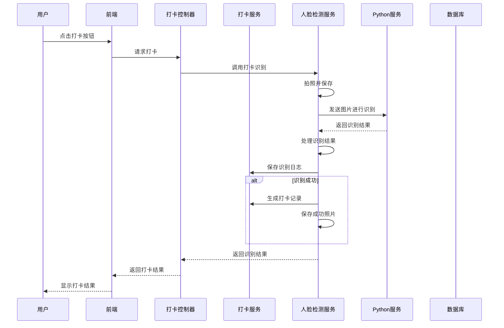

## 一、打卡功能设计

### 1. 核心流程设计

### 2. 服务层设计

* **实体类**：`AttendanceRecord`（打卡记录）、`FaceRecognitionLog`（识别日志）

* **仓库**：`AttendanceRecordRepository`、`FaceRecognitionLogRepository`

* **服务**：`AttendanceService`（打卡服务）

* **控制器**：`AttendanceController`（打卡控制器）

### 3. 识别结果处理

| 识别状态          | 处理逻辑                          |
| ------------- | ----------------------------- |
| recognized    | 记录打卡成功，生成打卡记录，保存成功照片          |
| unknown\_face | 记录打卡失败，生成打卡记录，保存失败图片，提示"未知人脸" |
| no\_face      | 无需提示                          |
| 其他异常          | 记录打卡失败，提示"系统异常，请联系管理员"        |

## 二、自动检测逻辑修改

### 1. 开启/停止机制

* 添加布尔字段 `detectionEnabled` 控制自动检测开关

* 添加 `startDetection()` 和 `stopDetection()` 方法

* 修改 `realTimeFaceDetection()` 方法，仅当 `detectionEnabled` 为 true 时执行

### 2. API设计

| API路径                             | 方法   | 功能        |
| --------------------------------- | ---- | --------- |
| `/recognition/detection/start`    | POST | 开启自动检测    |
| `/recognition/detection/stop`     | POST | 停止自动检测    |
| `/recognition/detection/status`   | GET  | 获取自动检测状态  |
| `/recognition/detection/schedule` | POST | 设置定时开启/关闭 |

### 3. 定时开启/关闭

* 添加 `startTime` 和 `endTime` 字段存储定时时间

* 添加定时任务，定期检查当前时间是否在开启时间范围内

* 根据检查结果自动开启或关闭检测

## 三、人脸验证成功后保存照片

### 1. 配置设计

* 在 `FaceRecognitionConfig` 中添加 `failPhotoPath` 配置项

* 用于存储验证失败的照片路径

* 在 `FaceRecognitionConfig` 中的`photoPath` 配置项的路径用于存储验证成功的照片路径

### 2. 实现逻辑

* 在 `handleVerificationResult()` 方法中，当识别结果为 "recognized" 时

* 将照片复制到 `photoPath` 目录下

* 命名格式：`当前时间_人名.jpg`

* 在 `handleVerificationResult()` 方法中，当识别结果为 "unknown\_face" 时

* 将照片复制到 `failPhotoPath` 目录下

* 命名格式：`fail_当前时间_人名.jpg`

## 四、数据库记录设计

### 1. 识别日志表（face\_recognition\_log）

| 字段名               | 数据类型         | 描述     |
| ----------------- | ------------ | ------ |
| id                | BIGINT       | 主键ID   |
| recognition\_time | DATETIME     | 识别时间   |
| status            | VARCHAR(20)  | 识别状态   |
| recognized\_name  | VARCHAR(50)  | 识别到的姓名 |
| photo\_path       | VARCHAR(255) | 照片路径   |
| created\_at       | DATETIME     | 创建时间   |

### 2. 打卡记录表（attendance\_record）

| 字段名                  | 数据类型        | 描述              |
| -------------------- | ----------- | --------------- |
| id                   | BIGINT      | 主键ID            |
| user\_id             | BIGINT      | 用户ID            |
| user\_name           | VARCHAR(50) | 用户名             |
| punch\_time          | DATETIME    | 打卡时间            |
| punch\_type          | TINYINT     | 打卡类型（1：上班，2：下班） |
| status               | TINYINT     | 打卡状态（1：成功，0：失败） |
| recognition\_log\_id | BIGINT      | 关联识别日志ID        |
| created\_at          | DATETIME    | 创建时间            |

## 五、实现步骤

1. 创建数据库实体类和仓库
2. 实现打卡服务和控制器
3. 修改 `FaceDetectionServiceImpl`，添加开关控制
4. 实现自动检测的开启/停止API
5. 实现定时开启/关闭功能
6. 实现验证后的照片保存功能
7. 实现识别结果记录到数据库
8. 实现打卡功能与识别模块的对接
9. 添加Swagger注解和文档
10. 测试功能完整性

## 六、技术要点

* 根据现有的代码风格进行数据库操作

* 使用Spring Scheduling实现定时任务

* 使用RESTful API设计原则

* 严格遵循现有代码风格和命名规范

* 添加完整的Swagger文档

* 实现事务管理，确保数据一致性

* 处理各种异常情况，确保系统稳定性

## 七、API接口设计

### 1. 打卡相关API

| API路径                    | 方法   | 功能            |
| ------------------------ | ---- | ------------- |
| `/attendance/punch`      | POST | 手动打卡          |
| `/attendance/record`     | GET  | 获取个人打卡记录      |
| `/attendance/record/all` | GET  | 获取所有打卡记录（管理员） |
| `/attendance/statistics` | GET  | 获取打卡统计数据      |

### 2. 自动检测控制API

| API路径                             | 方法   | 功能        |
| --------------------------------- | ---- | --------- |
| `/recognition/detection/start`    | POST | 开启自动检测    |
| `/recognition/detection/stop`     | POST | 停止自动检测    |
| `/recognition/detection/status`   | GET  | 获取自动检测状态  |
| `/recognition/detection/schedule` | POST | 设置定时开启/关闭 |

### 3. 识别日志API

| API路径                   | 方法  | 功能       |
| ----------------------- | --- | -------- |
| `/recognition/log`      | GET | 获取识别日志   |
| `/recognition/log/{id}` | GET | 获取单条识别日志 |

## 八、代码修改计划

1. **配置文件修改**：

   * 添加 `face.detection.success-photo-path` 配置项

   * 修改 `face.detection.interval` 配置说明

2. **服务层修改**：

   * 修改 `FaceDetectionServiceImpl`，添加自动检测开关

   * 添加识别结果记录到数据库的逻辑

   * 实现验证成功照片保存功能

3. **控制器修改**：

   * 新增 `AttendanceController` 处理打卡请求

   * 新增 `DetectionController` 处理自动检测控制请求

   * 新增 `RecognitionLogController` 处理识别日志请求

4. **数据库修改**：

   * 创建 `attendance_record` 表

   * 创建 `face_recognition_log` 表

5. **其他修改**：

   * 添加Swagger注解

   * 添加异常处理

   * 添加日志记录

## 九、测试计划

1. 测试手动打卡功能
2. 测试自动检测的开启/停止功能
3. 测试定时开启/关闭功能
4. 测试识别结果记录功能
5. 测试验证成功照片保存功能
6. 测试各种异常情况的处理
7. 测试API文档的完整性

## 十、预期效果

1. 实现了完整的打卡功能，支持手动打卡和自动打卡
2. 自动检测支持按需开启/停止，以及定时开启/关闭
3. 识别结果完整记录到数据库，便于查询和统计
4. 验证成功的照片保存到指定目录，便于管理和查看
5. API文档完整，便于前端对接和测试
6. 系统稳定性高，能处理各种异常情况
7. 代码风格一致，便于维护和扩展

## 十一、风险评估

1. **摄像头访问失败**：添加异常处理，提示"摄像头访问失败"
2. **人脸识别服务异常**：添加降级策略，提示"系统异常"
3. **数据库访问失败**：添加事务管理，确保数据一致性
4. **定时任务冲突**：使用分布式锁，避免重复执行
5. **照片存储问题**：添加存储空间监控，及时清理过期照片

    

以上设计方案基于现有代码结构，严格遵循用户要求，确保系统的完整性、稳定性和可扩展性。
